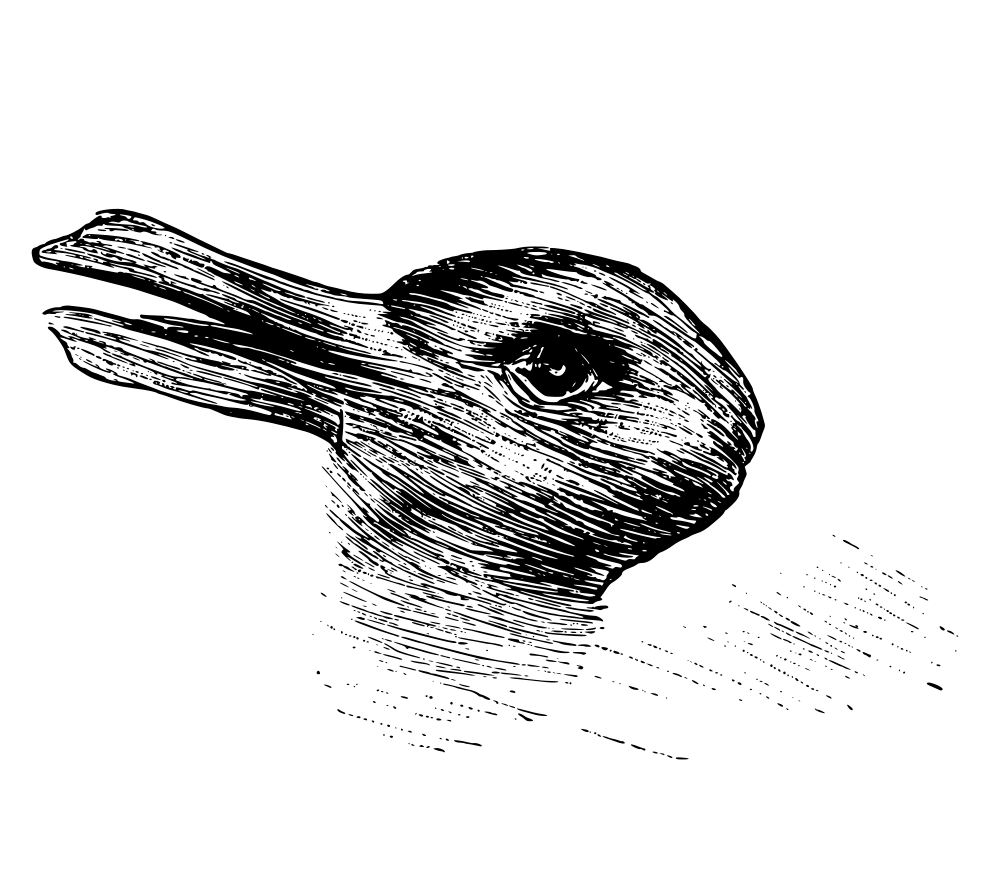

# Rabbit or Duck? It depends on how the image is rotated.

Python code to submit rotated images to the Cloud Vision API + R code for visualizing it. This repository was used to create [this animation](https://twitter.com/minimaxir/status/1103676561809539072).

All tools used:

* Python to rotate the image and get predictions from the API for each rotation.
* R, ggplot2, gganimate for building the animations.
* ffmpeg to render the animations.
* A video editor to stitch all the animations together.

**Disclaimer**: This was my first time working with gganimate (and working around a few bugs which surfaced), as a result my R code is messier than my typical R code.

## Maintainer

Max Woolf ([@minimaxir](http://minimaxir.com))

*Max's open-source projects are supported by his [Patreon](https://www.patreon.com/minimaxir). If you found this project helpful, any monetary contributions to the Patreon are appreciated and will be put to good creative use.*

## License

MIT